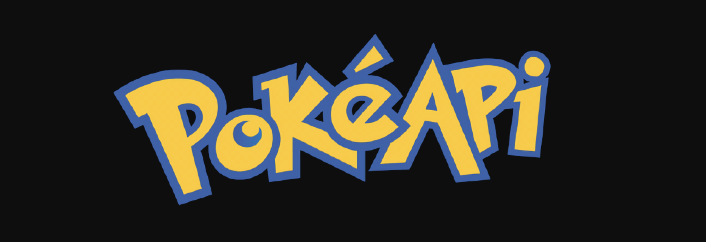
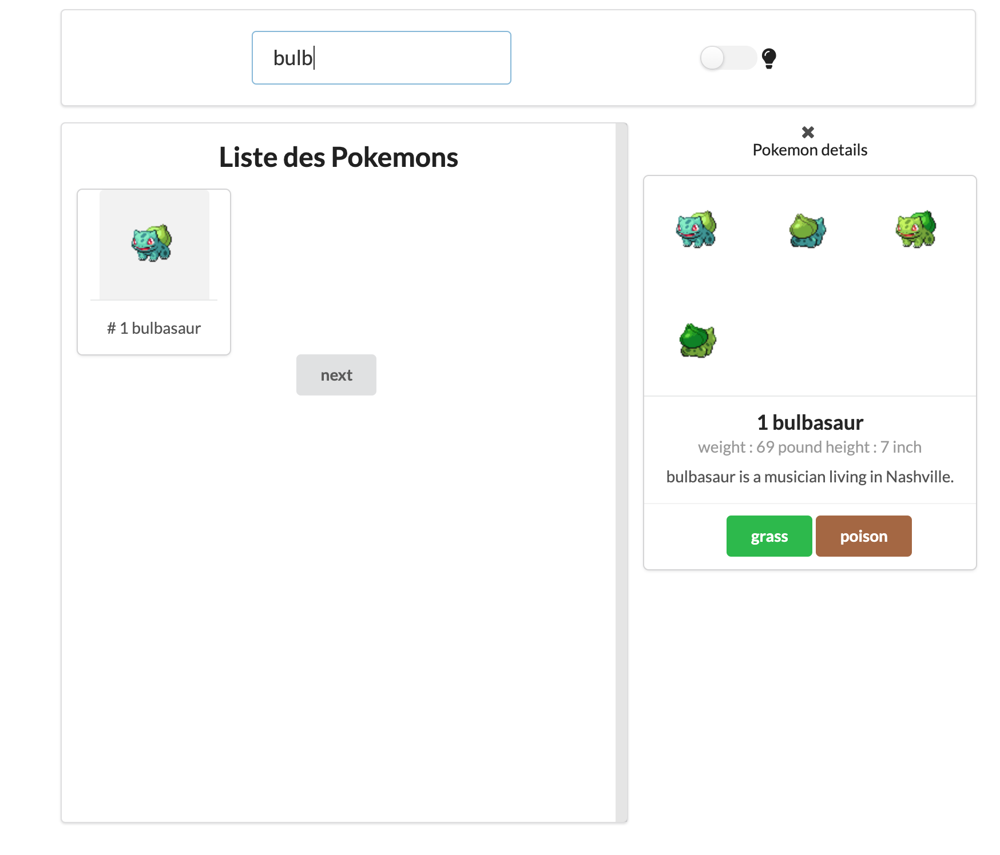
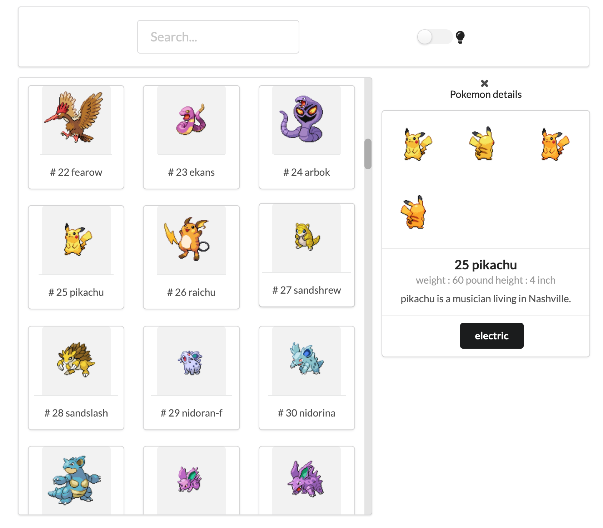

[![MIT License][license-shield]][license-url]


<!-- PROJECT LOGO -->
<br />
<p align="center">
  <a href="https://github.com/othneildrew/Best-README-Template">
    
  </a>

  <h3 align="center">React Pokedex App</h3>

  <div align="center">
  <h3>
    <a href="https://anthonydecuypersearchonpokemonapi.netlify.app/">
      Demo
    </a>
    <span> | </span>
    <a href="https://github.com/decuyperanthony/portefolio-react">
      Repository
    </a>
  </h3>
</div>

## Overviews




<!-- TABLE OF CONTENTS -->
## Table of Contents


* [About the Project](#about-the-project)
  * [Built With](#built-with)
* [Getting Started](#getting-started)
  * [Prerequisites](#prerequisites)
  * [Installation](#installation)
* [Contributing](#contributing)
* [License](#license)
* [Contact](#contact)


<!-- ABOUT THE PROJECT -->
## About The Project
Search on Pokemon API

### Built With

* [React](https://fr.reactjs.org/)
* [Redux](https://redux.js.org/)
* [Semanthic UI](https://semantic-ui.com/)
* [PokeAPI](https://pokeapi.co/)


<!-- GETTING STARTED -->
## Getting Started


### Installation

1. Clone the repo
```sh
git clone https://github.com/decuyperanthony/react-pokedex-decuyperanthony
```

2. Install YARN client packages && start server
```sh
yarn
yarn start
```


<!-- LICENSE -->
## License

Distributed under the MIT License. See `LICENSE` for more information.


<!-- CONTACT -->
## Contact

Anthony de Cuyper - [linkedin](https://www.linkedin.com/in/anthony-de-cuyper/) - decuyperanthony@gmail.com

Project Link: [https://github.com/decuyperanthony/react-pokedex-decuyperanthony](https://github.com/decuyperanthony/react-pokedex-decuyperanthony)


<!-- MARKDOWN LINKS & IMAGES -->
<!-- https://www.markdownguide.org/basic-syntax/#reference-style-links -->
[contributors-shield]: https://img.shields.io/github/contributors/othneildrew/Best-README-Template.svg?style=flat-square
[contributors-url]: https://github.com/othneildrew/Best-README-Template/graphs/contributors
[forks-shield]: https://img.shields.io/github/forks/othneildrew/Best-README-Template.svg?style=flat-square
[forks-url]: https://github.com/othneildrew/Best-README-Template/network/members
[stars-shield]: https://img.shields.io/github/stars/othneildrew/Best-README-Template.svg?style=flat-square
[stars-url]: https://github.com/othneildrew/Best-README-Template/stargazers
[issues-shield]: https://img.shields.io/github/issues/othneildrew/Best-README-Template.svg?style=flat-square
[issues-url]: https://github.com/othneildrew/Best-README-Template/issues
[license-shield]: https://img.shields.io/github/license/othneildrew/Best-README-Template.svg?style=flat-square
[license-url]: https://github.com/othneildrew/Best-README-Template/blob/master/LICENSE.txt
[linkedin-shield]: https://img.shields.io/badge/-LinkedIn-black.svg?style=flat-square&logo=linkedin&colorB=555
[linkedin-url]: https://linkedin.com/in/othneildrew
[product-screenshot]: images/screenshot.png